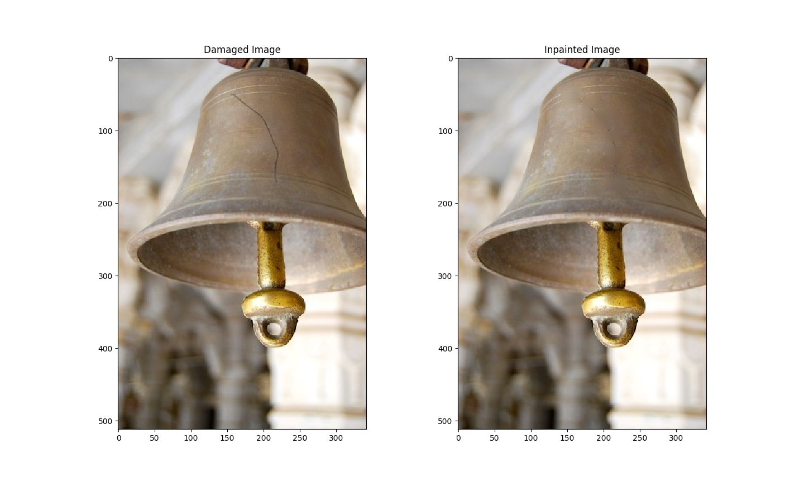

# Bilateral Image Inpainting
> This project implements a new inpainting method that proposes convolution with a bilateral averaging kernel. Traditional  convolution-based inpainting use image information from only a space neighborhood. A more robust approach (in structure and texture preserving) of convolution–based inpainting is using information from both space and range. This implementation produces some fascinating results when it comes to structural and textural restoration of damaged regions of the image.

## Steps to follow:
- ### Clone the project repository
  - git clone https://github.com/raj-shubham/Bilateral_Image_Inpainting.git
- ### Change path in the following files:
  - Bilateral_Image_Inpainting/code/config/settings.config
    ```shell
    "master_working_directory": "/Users/mymac/Desktop/Assignments/DIP-Assignments/Project/test/Bilateral_Image_Inpainting/code/"
    "log_directory": "/Users/mymac/Desktop/Assignments/DIP-Assignments/Project/test/Bilateral_Image_Inpainting/code/config"
    
    to 
    
    "master_working_directory": "Your_Directory/Bilateral_Image_Inpainting/code/"
    "log_directory": "Your_Directory/Bilateral_Image_Inpainting/code/config"
    ```
  - Bilateral_Image_Inpainting/code/GUI/mousecallback.py
    ```shell
    master_working_path = "/Users/mymac/Desktop/Assignments/DIP-Assignments/Project/test/Bilateral_Image_Inpainting/code/"
    
    to 
    
    master_working_path = "Your_Directory/Bilateral_Image_Inpainting/code/"
    ```

## Install the required python modules used in the project (execute inside /Bilateral_Image_Inpainting):
```shell
$ pip3 install -r requirements.txt
```

## Compile using the following command (execute inside /Bilateral_Image_Inpainting):
```python
$ python -m compileall .
```

## Help 
```python
$ python3 mousecallback.py -h
or 
$ python3 mousecallback.py --help
```

```shell
usage: mousecallback.py [-h]
                        image_width kernel_width sigma_range sigma_domain
                        filter_itr

Performs inpainting eg. python3 mousecallback.py 20 5 10.0 0.5 2

positional arguments:
  image_width   neighbourhood range of image (type: int ; eg. 20)
  kernel_width  kernel size (odd number) (type: int ; eg. 5)
  sigma_range   variation across intensity (type: float ; eg. 10.0)
  sigma_domain  variation across distance (type: float ; eg. 0.5)
  filter_itr    iterations over damaged regions (type: int ; eg. 2)

optional arguments:
  -h, --help    show this help message and exit
```

## Execute
```python
$ python3 mousecallback.py 20 5 10.0 0.5 2
```

## Result:

